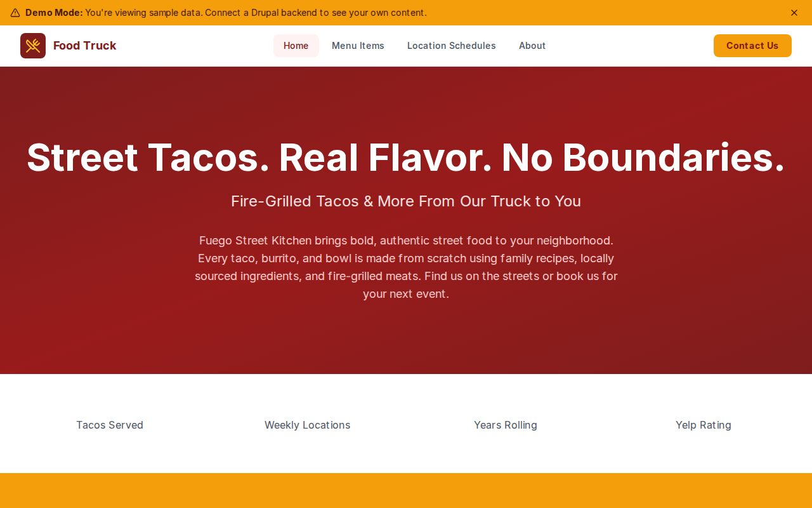

# Decoupled Food Truck

A mobile food truck website built with Next.js and Decoupled Drupal, designed for food trucks, street food vendors, and mobile kitchens to showcase their menu, weekly schedule, and catering services.



[](https://vercel.com/new/clone?repository-url=https://github.com/nicholasio/decoupled-food-truck&project-name=decoupled-food-truck)

## Features

- Display the full **menu** with pricing, spice levels, dietary info, and bestseller flags
- Show the weekly **location schedule** with addresses, times, and neighborhoods
- Dynamic homepage with hero section, statistics, and call-to-action areas
- Static **pages** for about and event catering information

## Quick Start

### 1. Clone the template

```bash
npx degit nicholasio/decoupled-food-truck my-food-truck
cd my-food-truck
npm install
```

### 2. Run interactive setup

```bash
npm run setup
```

### 3. Start development

```bash
npm run dev
```

Visit [http://localhost:3000](http://localhost:3000)

---

## Manual Setup

<details>
<summary>Click to expand manual setup steps</summary>

### Authenticate with Decoupled.io

```bash
npx decoupled-cli@latest auth login
```

### Create a Drupal space

```bash
npx decoupled-cli@latest spaces create "Fuego Street Kitchen"
```

Note the space ID returned (e.g., `Space ID: 1234`). Wait ~90 seconds for provisioning.

### Configure environment

```bash
npx decoupled-cli@latest spaces env 1234 --write .env.local
```

### Import content

```bash
npm run setup-content
```

This imports the following sample content:

- **Menu Items:** Slow-Roasted Carnitas Taco ($4.50), Al Pastor Taco ($4.50), Baja Fish Taco ($5.00), Loaded Street Burrito ($12.00), Fuego Bowl ($11.00), Street Elote ($5.00)
- **Location Schedule:** Monday at Tech Park, Wednesday at Brewery Row, Saturday at Downtown Farmers Market
- **Pages:** About Fuego Street Kitchen, Event Catering & Private Bookings
- **Homepage:** Hero section, statistics (100K+ Tacos, 6 Locations, 7 Years, 4.9 Yelp Rating), and CTA

</details>

## Content Types

### Menu Item

Food truck menu items with pricing and dietary information.

| Field | Type | Description |
|-------|------|-------------|
| price | string | Item price |
| menu_category | term(menu_categories)[] | Category (Tacos, Burritos, etc.) |
| spice_level | string | Heat level |
| dietary_info | string[] | Dietary notes (Gluten-Free, Vegetarian, etc.) |
| is_bestseller | bool | Whether item is a bestseller |
| image | image | Item photo |
| body | text | Full item description |

### Location Schedule

Weekly schedule with locations and times.

| Field | Type | Description |
|-------|------|-------------|
| day_of_week | string | Day of the week |
| location_name | string | Name of the location |
| address | string | Street address |
| start_time | string | Opening time |
| end_time | string | Closing time |
| neighborhood | string | Neighborhood or district |
| image | image | Location photo |
| body | text | Location details |

### Homepage

Landing page with hero section, statistics, and call-to-action areas.

| Field | Type | Description |
|-------|------|-------------|
| hero_title | string | Hero headline |
| hero_subtitle | string | Hero subheading |
| hero_description | text | Hero body text |
| stats_items | paragraph(stat_item)[] | Statistics display |
| featured_items_title | string | Featured section title |
| cta_title | string | CTA section title |
| cta_description | text | CTA body text |
| cta_primary | string | Primary button label |
| cta_secondary | string | Secondary button label |

### Taxonomies

- **Menu Categories:** Tacos, Burritos, Bowls, Sides, Drinks, Specials

### Basic Page

Static content pages for about, catering, and other information.

| Field | Type | Description |
|-------|------|-------------|
| body | text | Page content |

## Customization

### Colors & Branding

Edit `tailwind.config.js` to customize colors, fonts, and spacing for your food truck's brand.

### Content Structure

Modify `data/food-truck-content.json` to update menu items, location schedule, and other sample content.

### Components

React components are in `app/components/`. Update them to match your food truck's design and personality.

## Demo Mode

### Enable Demo Mode

Set the environment variable:

```bash
NEXT_PUBLIC_DEMO_MODE=true
```

Or add to `.env.local`:

```
NEXT_PUBLIC_DEMO_MODE=true
```

### What Demo Mode Does

- Shows a "Demo Mode" banner at the top of the page
- Returns mock data for all GraphQL queries
- Displays sample menu items, schedule, and homepage content
- No Drupal backend required

### Removing Demo Mode

To convert to a production app with real data:

1. Delete `lib/demo-mode.ts`
2. Delete `data/mock/` directory
3. Delete `app/components/DemoModeBanner.tsx`
4. Remove `DemoModeBanner` from `app/layout.tsx`
5. Remove demo mode checks from `app/api/graphql/route.ts`

## Deployment

### Vercel (Recommended)

[](https://vercel.com/new/clone?repository-url=https://github.com/nicholasio/decoupled-food-truck)

Set `NEXT_PUBLIC_DEMO_MODE=true` in Vercel environment variables for a demo deployment.

### Other Platforms

Works with any Node.js hosting platform that supports Next.js.

## Documentation

- [Decoupled.io Docs](https://www.decoupled.io/docs)
- [Next.js Documentation](https://nextjs.org/docs)
- [Drupal GraphQL](https://www.decoupled.io/docs/graphql)

## License

MIT
